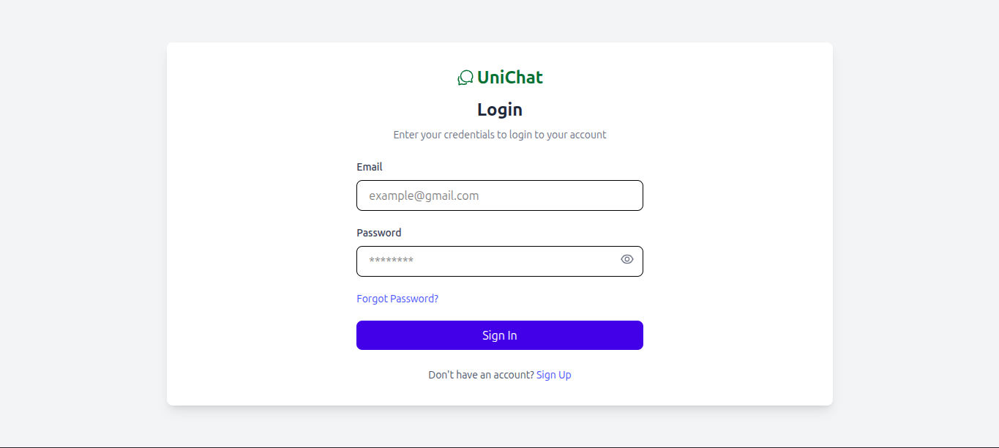
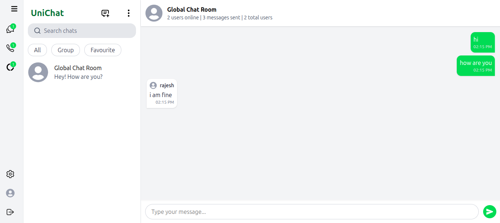

# NexChat 💬


A full-stack real-time chat application where users can register, log in, and communicate instantly in a global chat room. Built with the MERN stack, Socket.IO for real-time events, and TypeScript throughout.

---

## Screenshots

| Login                        | Chat Room                      |
| ---------------------------- | ------------------------------ |
|  |  |

---

## Features

- 🔐 User registration and login with JWT authentication
- 💬 Global real-time chat room powered by Socket.IO
- 👥 Live online user count — updates instantly as users join or leave
- 📊 Total message count and total registered users displayed in real time
- 🔒 HTTP-only cookies for secure session management
- 📱 Fully responsive — works on mobile, tablet, and desktop
- 🚪 Protected routes — unauthenticated users redirected to login
- 📜 Chat history loaded from MongoDB on page refresh
- ✅ Input validation with Zod on the backend

---

## Tech Stack

### Frontend

| Technology       | Purpose                     |
| ---------------- | --------------------------- |
| React 18 + Vite  | UI framework and build tool |
| TypeScript       | Type safety                 |
| Tailwind CSS     | Styling                     |
| Zustand          | Global state management     |
| Socket.IO frontend | Real-time communication     |
| Axios            | HTTP requests               |
| React Router DOM | frontend-side routing         |
| React Toastify   | Toast notifications         |
| React Icons      | Icon library                |

### Backend

| Technology           | Purpose                       |
| -------------------- | ----------------------------- |
| Node.js + Express.js | backend framework              |
| TypeScript           | Type safety                   |
| MongoDB + Mongoose   | Database and ODM              |
| Socket.IO            | Real-time WebSocket events    |
| JSON Web Token (JWT) | Authentication                |
| bcryptjs             | Password hashing              |
| Zod                  | Request validation            |                    
| cookie-parser        | HTTP-only cookie handling     |
| cors                 | Cross-origin resource sharing |

## Environment Variables

### Frontend — `frontend/.env`

```env
VITE_API_URL=http://localhost:5000/api
VITE_SOCKET_URL=http://localhost:5000
```

### Backend — `backend/.env`

```env
PORT=5000
MONGO_URL=mongodb://localhost:27017/NexChat
JWT_SECRET=your_jwt_secret_key_here
frontend_URL=http://localhost:5173
```

---

## Installation & Setup

### Prerequisites

- Node.js >= 18.0.0
- MongoDB running locally or MongoDB Atlas URI
- npm or yarn

### 1. Clone the repository

```bash
git clone https://github.com/neupanesudip/NexChat.git
cd NexChat
```

### 2. Setup the backend

```bash
cd backend
npm install
cp .env.example .env
# Fill in your values in .env
npm run dev
```

### 3. Setup the frontend

```bash
cd frontend
npm install
cp .env.example .env
# Fill in your values in .env
npm run dev
```

### 4. Open in browser

```
http://localhost:5173
```

---

## Production Build

### Frontend

```bash
cd frontend
npm run build
```

### Backend

```bash
cd backend
npm run build
npm start

```

---

## API Endpoints

### Auth Routes — `/api/auth`

| Method | Endpoint    | Auth Required | Description                |
| ------ | ----------- | ------------- | -------------------------- |
| POST   | `/register` | No            | Register a new user        |
| POST   | `/login`    | No            | Login and receive cookie   |
| POST   | `/logout`   | Yes           | Clear session cookie       |
| GET    | `/verify`   | Yes           | Verify current session     |
| GET    | `/me`       | Yes           | Get logged in user details |
| GET    | `/count`    | Yes           | Get total registered users |

### Message Routes — `/api/messages`

| Method | Endpoint  | Auth Required | Description                      |
| ------ | --------- | ------------- | -------------------------------- |
| POST   | `/`       | Yes           | Send a message                   |
| GET    | `/`       | Yes           | Get all messages                 |
| GET    | `/counts` | Yes           | Get total message and user count |

---

## Socket.IO Events

### frontend → backend

| Event         | Payload               | Description        |
| ------------- | --------------------- | ------------------ |
| `sendMessage` | `{ message: string }` | Send a new message |

### backend → frontend

| Event            | Payload                                             | Description                          |
| ---------------- | --------------------------------------------------- | ------------------------------------ |
| `receiveMessage` | `{ _id, senderId, senderName, message, createdAt }` | Broadcast new message                |
| `chatHistory`    | `Message[]`                                         | Send full message history on connect |
| `stats`          | `{ onlineUsers, totalMessages, totalUsers }`        | Live stats update                    |
| `userJoined`     | `{ name: string }`                                  | Notify when a user joins             |

---

## Security

- 🔐 Passwords hashed with **bcryptjs** (salt rounds: 10)
- 🍪 JWT stored in **HTTP-only cookies** — not accessible via JavaScript, prevents XSS
- 🛡️ All protected routes verified via **JWT middleware**
- ✅ All request payloads validated with **Zod** before reaching business logic
- 🌐 **CORS** configured to allow only the frontend origin
- 🔑 Environment variables used for all secrets — never hardcoded

## Author

**Sudip Neupane**  
📧 neupanesudip90@gmail.com  
🌐 [sudipneupane01.com.np](https://sudipneupane01.com.np)  
💼 [LinkedIn](https://www.linkedin.com/in/sudipneupane-dev/)  
🐙 [GitHub](https://github.com/neupanesudip90)

---

## License

This project is licensed under the [MIT License](LICENSE).
